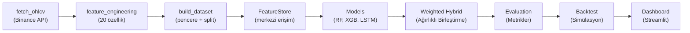
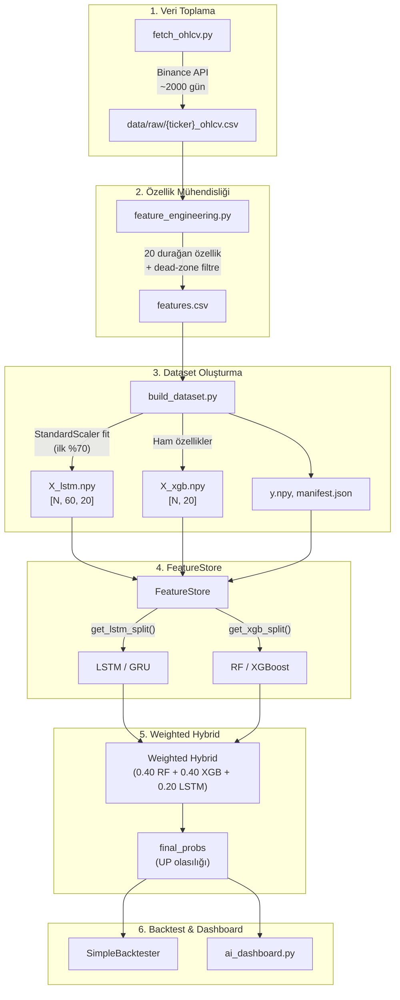
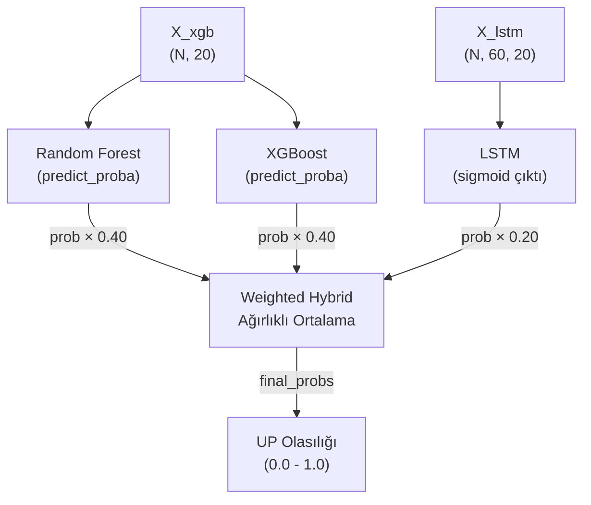
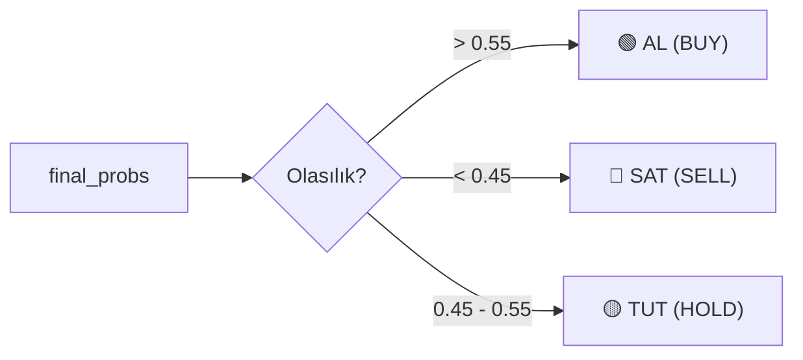
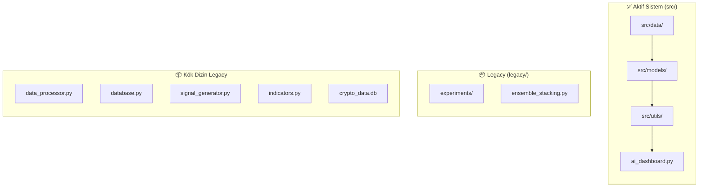

# 🏗️ Sistem Mimarisi (Architecture)

> **Proje:** ML Tabanlı Kripto Fiyat Yönü Tahmin Sistemi  
> **Versiyon:** 3.0 (Unified FeatureStore)  
> **Son Güncelleme:** Haziran 2026

---

## 1. Sistem Genel Bakışı

Bu proje, kripto para birimlerinin (BTC, ETH, SOL) bir sonraki günkü fiyat **yön tahmini** yapan bir makine öğrenmesi sistemidir. Sistem bir **trading bot değildir** — otomatik alım-satım yapmaz; yalnızca karar destek amacıyla olasılık üretir.

### Temel Özellikler

| Özellik | Detay |
|---------|-------|
| **Amaç** | Ertesi gün kapanış yönü tahmini (UP / DOWN) |
| **Desteklenen Coinler** | `BTC-USD`, `ETH-USD`, `SOL-USD` |
| **Model Sayısı** | 3 base model (RF, XGB, LSTM) — Weighted Hybrid birleştirme |
| **Feature Sayısı** | 20 durağan (stationary) özellik |
| **Veri Kaynağı** | Binance API (günlük OHLCV) |
| **Dashboard** | Streamlit (`ai_dashboard.py`) |

---

## 2. Veri Akış Mimarisi (Data Flow)

Sistemin uçtan uca veri akışı aşağıdaki pipeline'ı takip eder:



### Pipeline Adımları Detayı



### `src/pipeline.py` Çalıştırma Sırası

Pipeline tek bir komutla tüm adımları sırayla çalıştırır:

```
python -m src.pipeline --step all --coin BTC-USD
```

| Adım | Modül | Açıklama |
|------|-------|----------|
| 1/5 | `build_dataset` | Veri çekme + özellik üretme + dataset oluşturma |
| 2/5 | `time_series_models` | LSTM eğitimi |
| 3/5 | `ml_classification_models` | Random Forest ve XGBoost eğitimi |
| 4/5 | `weight_selector` | Validation üzerinde ağırlık seçimi + test metrikleri |
| 5/5 | `backtester` | Weighted Hybrid sinyali ile backtest |

---

## 3. Ensemble Model Mimarisi

### 3.1 Base Modeller ve Rolleri

| Model | Tür | Girdi Shape | Rol | Açıklama |
|-------|-----|-------------|-----|----------|
| **Random Forest** | Tabular ML | `(N, 20)` | 🔵 Ana model | Ham özelliklerle çalışır, overfitting'e dayanıklı |
| **XGBoost** | Tabular ML | `(N, 20)` | 🔵 Ana model | Gradient boosting, non-linear pattern'larda güçlü |
| **LSTM** | Deep Learning | `(N, 60, 20)` | 🟡 Destek model | Temporal pattern, 60 günlük pencere |
| **GRU** | Deep Learning | `(N, 60, 20)` | 🟡 Destek model | LSTM'e alternatif, daha az parametre |

### 3.2 Karar Formülü — Weighted Hybrid

Üretim sisteminde **şeffaf ağırlıklı hibrit formül** kullanılmaktadır:

```
final_prob = 0.40 × RF_prob + 0.40 × XGB_prob + 0.20 × LSTM_prob
```

**Fallback mekanizması** (LSTM kalitesine göre):

| Durum | Formül |
|-------|--------|
| LSTM makul (val F1 > 0.40) | 0.40 RF + 0.40 XGB + 0.20 LSTM |
| LSTM zayıf (F1 ≤ 0.40) | 0.45 RF + 0.45 XGB + 0.10 LSTM |
| LSTM dejenere (tek sınıf) | 0.50 RF + 0.50 XGB + 0.00 LSTM |

> [!NOTE]
> **Tasarım kararı:** Eski GradientBoosting meta-model (`ensemble_model.py`) daha karmaşık bir
> birleştirme yapabiliyordu ancak şeffaf ve savunulabilir olması açısından basit ağırlıklı
> ortalama tercih edilmiştir. Ağırlık seçimi validation seti üzerinde yapılır, test setine sızıntı yoktur.

### 3.3 [Legacy] Meta-Model Eğitim Detayları

> [!WARNING]
> Aşağıdaki bölüm eski GradientBoosting meta-model mimarisine aittir.
> **Ana pipeline artık bu meta-modeli kullanmaz.** Referans amaçlı korunmaktadır.

```python
# Eski meta-model (src/models/ensemble_model.py)
GradientBoostingClassifier(
    n_estimators=200,
    max_depth=2,
    learning_rate=0.05,
    subsample=0.7,
    min_samples_leaf=10,
    validation_fraction=0.15,
    n_iter_no_change=15,
    random_state=42
)
```

### 3.4 Weighted Hybrid Akış Diyagramı



---

## 4. FeatureStore — Merkezi Veri Erişimi

`FeatureStore`, tüm modellerin **aynı train/val/test bölümlerini** kullanmasını garanti eden merkezi bir veri erişim katmanıdır.

### 4.1 Split Stratejisi

```
Toplam: N örnek (pencere sayısı)

[─────── TRAIN (70%) ───────][purge_gap=60][──── VAL (15%) ────][purge_gap=60][──── TEST (15%) ────]
```

| Parametre | Değer | Açıklama |
|-----------|-------|----------|
| `TRAIN_RATIO` | 0.70 | Eğitim seti oranı |
| `VAL_RATIO` | 0.15 | Doğrulama seti oranı |
| `TEST_RATIO` | 0.15 | Test seti oranı |
| `PURGE_GAP` | 60 gün | Setler arası boşluk (veri sızıntısı önlemi) |

> [!WARNING]
> **Purge Gap neden gerekli?** LSTM 60 günlük pencere kullandığından, train setinin son penceresi ile val setinin ilk penceresi arasında veri çakışması olabilir. 60 günlük boşluk bu sızıntıyı önler.

### 4.2 API Kullanımı

```python
from src.data.feature_store import FeatureStore

store = FeatureStore("BTC-USD")

# LSTM/GRU için ölçeklenmiş pencereler
X_train, y_train = store.get_lstm_split("train")  # (N, 60, 20)

# RF/XGBoost için ham tek satır
X_test, y_test = store.get_xgb_split("test")      # (N, 20)

# Backtest için fiyatlar
prices = store.get_close_split("test")
```

---

## 5. Backtest Akışı

Backtest modülü, Weighted Hybrid formülünün ürettiği olasılıkları threshold tabanlı sinyallere çevirir ve simüle ticaret yapar.

### 5.1 Sinyal Üretimi (Threshold-Based)

```python
# final_probs: Weighted Hybrid'in UP olasılığı (0.0 - 1.0)
signals[final_probs > 0.55] = 2   # AL (BUY)
signals[final_probs < 0.45] = 0   # KAPAT (CLOSE)
signals[0.45 <= final_probs <= 0.55] = 1  # TUT (HOLD)
```



### 5.2 Karşılaştırma Stratejileri

| Strateji | Açıklama |
|----------|----------|
| **Weighted Hybrid** | Ağırlıklı hibrit threshold sinyalleri |
| **Buy & Hold** | İlk gün al, son güne kadar tut |
| **Nakit Tut** | Hiç işlem yapma (%0 referans) |

### 5.3 Performans Metrikleri

- **Toplam Getiri (%)**: Başlangıç-son portföy farkı
- **Sharpe Oranı**: Risk-ayarlı getiri (yıllık, 252 gün)
- **Max Drawdown (%)**: En büyük zirveden düşüş
- **Win Rate (%)**: FIFO eşleştirme ile kazanan işlem oranı
- **Toplam İşlem Sayısı**: AL + SAT toplam sayısı

---

## 6. Dead-Zone Filtre Mekanizması

Küçük fiyat hareketleri gürültü olarak kabul edilir ve veri setinden çıkarılır:

```
abs(next_return) ≤ 0.0015  →  Dead-zone (çıkarılır)
next_return > +0.0015      →  UP (1)
next_return < -0.0015      →  DOWN (0)
```

> [!TIP]
> **Threshold = ±%0.15**: Bu değer, komisyon ve spread maliyetlerini karşılayamayacak kadar küçük fiyat değişimlerini filtreleyerek daha temiz etiketler üretir. BTC-USD için genellikle ~%8-10 örnek bu filtreden çıkar.

---

## 7. Legacy / Experiments Ayrımı

### 7.1 Ayrım Gerekçesi

Proje başlangıçta bir "kripto trading botu" olarak tasarlanmış, sonradan **ML tabanlı yön tahmin sistemi** olarak yeniden odaklanmıştır. Eski kod tabanı referans amaçlı saklanır.



### 7.2 Dosya Durumları

| Dosya/Dizin | Durum | Açıklama |
|-------------|-------|----------|
| `src/` | ✅ Aktif | Ana ML pipeline |
| `ai_dashboard.py` | ✅ Aktif | Streamlit dashboard |
| `legacy/experiments/` | 📦 Arşiv | Deneysel ensemble yaklaşımları |
| `data_processor.py` | ⚠️ Legacy | Eski veri işleme (kullanılmıyor) |
| `database.py` | ⚠️ Legacy | SQLite tabanlı eski veri yönetimi |
| `signal_generator.py` | ⚠️ Legacy | Eski sinyal üretici |
| `indicators.py` | ⚠️ Legacy | Eski teknik göstergeler |
| `crypto_data.db` | ⚠️ Legacy | Eski SQLite veritabanı (~25MB) |

---

## 8. Dizin Yapısı

```
📁 Proje Kökü/
├── 📁 src/                          # Ana kaynak kodu
│   ├── 📁 data/                     # Veri pipeline modülleri
│   │   ├── fetch_ohlcv.py           #   Binance'den OHLCV çekme
│   │   ├── feature_engineering.py   #   20 durağan özellik üretimi
│   │   ├── build_dataset.py         #   Dataset oluşturma + split
│   │   ├── feature_store.py         #   Merkezi veri erişim (FeatureStore)
│   │   ├── ml_config.py             #   Sabitler ve konfigürasyon
│   │   ├── loader.py                #   Veri yükleyici (wrapper)
│   │   └── data_pipeline.py         #   Pipeline tetikleyici
│   │
│   ├── 📁 models/                   # Model modülleri
│   │   ├── time_series_models.py    #   LSTM + GRU eğitimi
│   │   ├── ml_classification_models.py  #   RF + XGBoost eğitimi
│   │   ├── ensemble_model.py        #   [Legacy] Eski meta-model eğitimi
│   │   ├── meta_inference.py        #   Weighted Hybrid tahmin üretici
│   │   └── 📁 saved_models/         #   Kaydedilmiş model dosyaları
│   │       ├── {ticker}_rf_classifier.pkl
│   │       ├── {ticker}_xgb_classifier.pkl
│   │       ├── {ticker}_lstm_best.pth
│   │       ├── {ticker}_gru_best.pth
│   │       ├── {ticker}_ensemble_meta_model.pkl
│   │       └── {ticker}_dl_thresholds.json
│   │
│   ├── 📁 evaluation/              # Metrikler ve ağırlık seçimi
│   ├── 📁 utils/                   # Yardımcı araçlar
│   │   └── backtester.py           #   Backtest motoru
│   ├── 📁 rl/                      # Reinforcement Learning modülü
│   └── pipeline.py                 # Ana pipeline yöneticisi
│
├── 📁 data/                        # Veri dosyaları
│   ├── 📁 raw/                     #   Ham OHLCV verileri
│   ├── 📁 ml/{ticker}/             #   ML dataset dosyaları
│   ├── 📁 processed/               #   Legacy uyumlu işlenmiş veriler
│   ├── 📁 exported/                #   Dışarı aktarılmış veriler
│   └── 📁 results/                 #   Backtest sonuç grafikleri
│
├── 📁 outputs/                     # Çıktı dosyaları
│   ├── 📁 charts/                  #   Grafikler
│   ├── 📁 metrics/                 #   Performans metrikleri
│   ├── 📁 predictions/             #   Tahmin sonuçları
│   └── 📁 logs/                    #   Log dosyaları
│
├── 📁 docs/                        # Proje belgeleri
│   ├── ARCHITECTURE.md             #   Bu dosya
│   ├── DATA_MAP.md                 #   Veri haritası
│   └── *.docx / *.pptx             #   Haftalık raporlar ve sunumlar
│
├── 📁 legacy/                      # Arşivlenmiş eski kod
│   └── 📁 experiments/             #   Deneysel ensemble yaklaşımları
│
├── ai_dashboard.py                 # Streamlit dashboard (ana arayüz)
├── config.py                       # Genel konfigürasyon
├── requirements.txt                # Python bağımlılıkları
└── README.md                       # Proje özeti
```

---

## 9. Teknoloji Stack

| Katman | Teknolojiler |
|--------|-------------|
| **Veri Toplama** | Binance API, `ccxt` / `requests` |
| **Özellik Mühendisliği** | `pandas`, `numpy`, `ta` (teknik analiz) |
| **ML Modelleri** | `scikit-learn` (RF, GradientBoosting), `xgboost` |
| **DL Modelleri** | `PyTorch` (LSTM, GRU + Attention) |
| **Ölçekleme** | `StandardScaler` (train-only fit) |
| **Serileştirme** | `joblib` (pkl), `torch.save` (pth), `numpy` (npy) |
| **Dashboard** | `Streamlit` |
| **Backtest** | Özel `SimpleBacktester` sınıfı |
| **Grafikler** | `matplotlib` |

---

## 10. Önemli Tasarım Kararları

### ✅ Neden Durağan (Stationary) Özellikler?
Ham fiyatlar (Open, High, Low, Close) doğrudan modele verilmez. Bunun yerine getiri oranları, teknik gösterge oranları ve normalize değerler kullanılır. Bu, modelin fiyat seviyesinden bağımsız örüntüleri öğrenmesini sağlar.

### ✅ Neden Unified FeatureStore?
Tüm modellerin aynı train/val/test bölümlerini kullanması, adil karşılaştırma yapılabilmesini ve veri sızıntısının önlenmesini sağlar.

### ✅ Neden Purge Gap = 60?
LSTM'in pencere boyutu 60 gün olduğundan, setler arasında en az 60 günlük boşluk bırakılarak temporal veri sızıntısı önlenir.

### ✅ Neden Weighted Hybrid (Ağırlıklı Ortalama)?
Eski GradientBoosting meta-model yerine, şeffaf ağırlıklı ortalama tercih edilmiştir. Bu yaklaşım savunulabilir, debug edilebilir ve LSTM dejenere olduğunda otomatik fallback mekanizması ile güvenli çalışır.

---

*Bu belge, projenin güncel mimarisini yansıtmaktadır. Değişiklikler için `src/` altındaki kaynak kodları referans alınız.*
