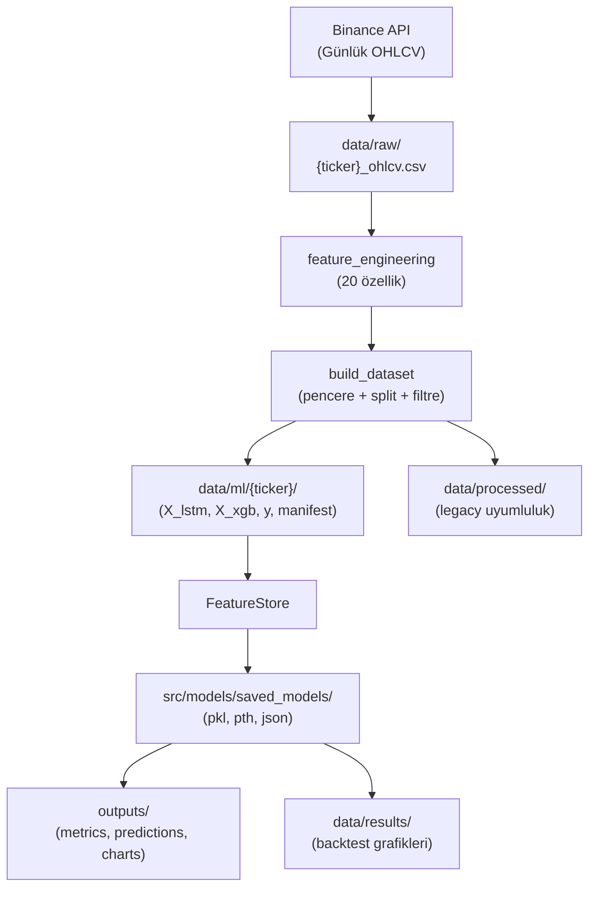
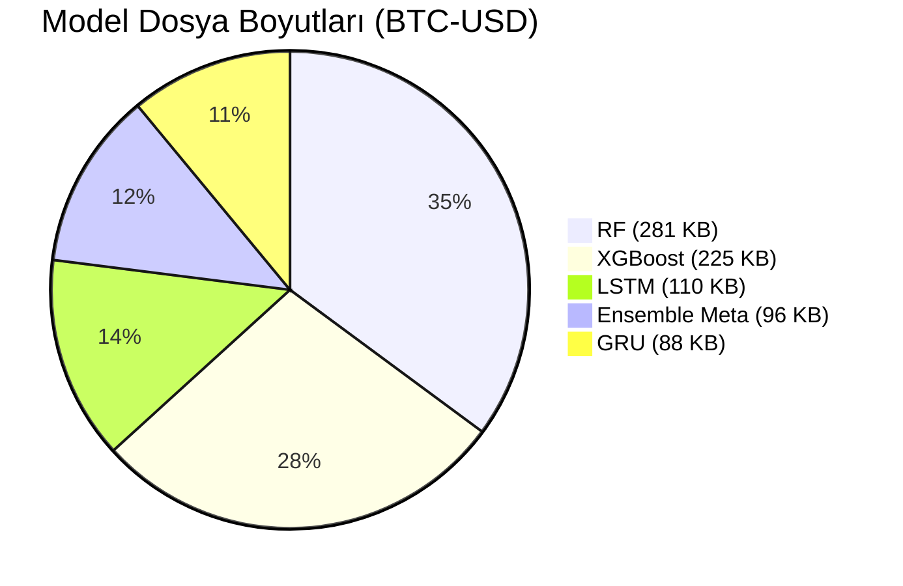
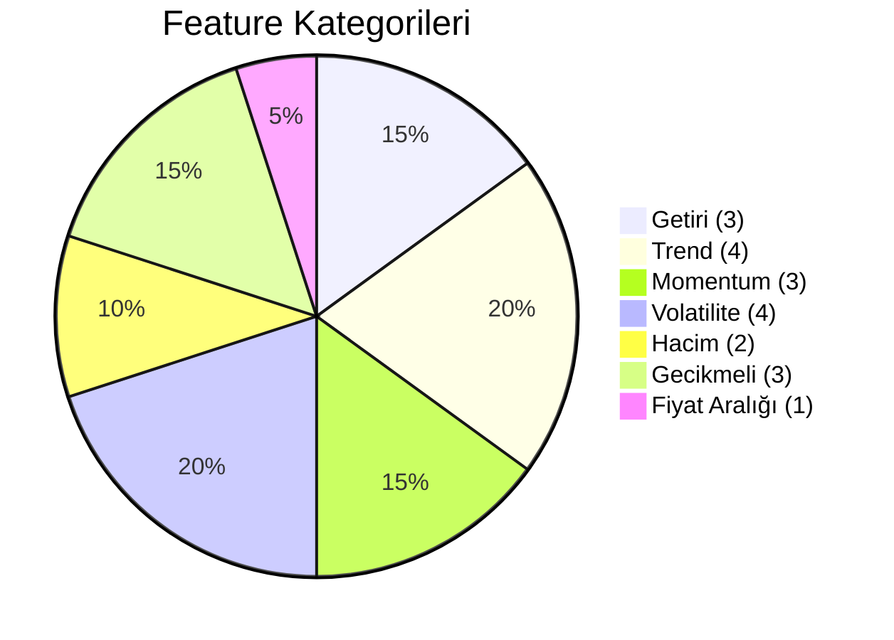
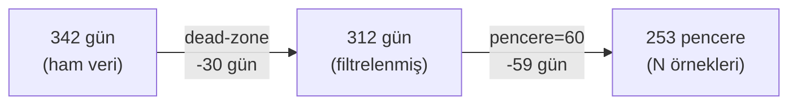
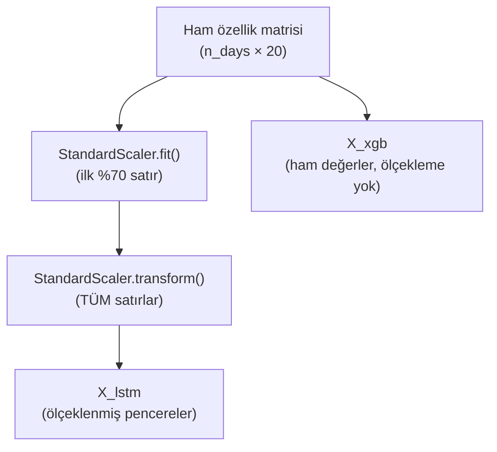
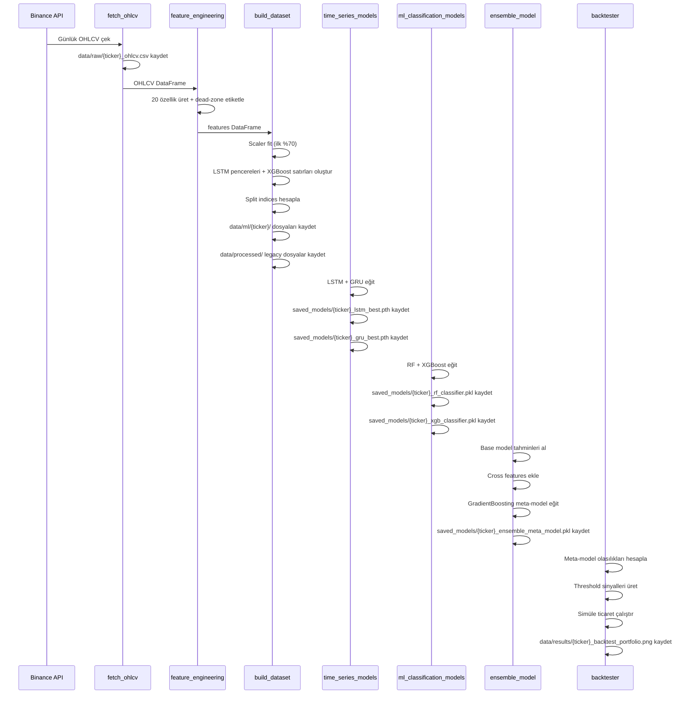

# 🗂️ Veri Haritası (Data Map)

> **Proje:** ML Tabanlı Kripto Fiyat Yönü Tahmin Sistemi  
> **Manifest Versiyonu:** v3 (Unified FeatureStore)  
> **Son Güncelleme:** Haziran 2026

Bu belge, projede üretilen ve kullanılan tüm veri dosyalarının konumlarını, formatlarını ve içeriklerini detaylı şekilde açıklar.

---

## 1. Genel Veri Akış Haritası



---

## 2. `data/raw/` — Ham OHLCV Verileri

**Üretici:** `src/data/fetch_ohlcv.py`  
**Kaynak:** Binance API (günlük mum verileri)

| Dosya | Format | Boyut | Açıklama |
|-------|--------|-------|----------|
| `BTC-USD_ohlcv.csv` | CSV | ~24 KB | Bitcoin ham OHLCV verisi |
| `BTC-USD_raw.csv` | CSV | ~24 KB | `_ohlcv.csv` ile aynı (uyumluluk kopyası) |
| `ETH-USD_ohlcv.csv` | CSV | ~22 KB | Ethereum ham OHLCV verisi |
| `ETH-USD_raw.csv` | CSV | ~22 KB | Uyumluluk kopyası |
| `SOL-USD_ohlcv.csv` | CSV | ~20 KB | Solana ham OHLCV verisi |
| `SOL-USD_raw.csv` | CSV | ~20 KB | Uyumluluk kopyası |

### CSV Sütunları

| Sütun | Tür | Açıklama |
|-------|-----|----------|
| `Date` (index) | datetime | Tarih (YYYY-MM-DD) |
| `open` | float | Açılış fiyatı |
| `high` | float | En yüksek fiyat |
| `low` | float | En düşük fiyat |
| `close` | float | Kapanış fiyatı |
| `volume` | float | İşlem hacmi |

> [!NOTE]
> `_raw.csv` ve `_ohlcv.csv` dosyaları **aynı içeriğe** sahiptir. `_raw.csv`, dashboard ve backtest modüllerinin geriye dönük uyumluluğu için oluşturulur.

---

## 3. `data/ml/{ticker}/` — ML Dataset Dosyaları

**Üretici:** `src/data/build_dataset.py`  
**Her ticker için ayrı klasör:** `BTC-USD/`, `ETH-USD/`, `SOL-USD/`

### 3.1 Dosya Listesi

| Dosya | Format | Shape / Boyut | Açıklama |
|-------|--------|---------------|----------|
| `manifest.json` | JSON | ~1.2 KB | Dataset metadata (v3) |
| `X_lstm.npy` | NumPy | `(N, 60, 20)` float32 | LSTM girdi pencereleri (ölçeklenmiş) |
| `X_xgb.npy` | NumPy | `(N, 20)` float32 | XGBoost/RF girdi satırları (ham) |
| `y.npy` | NumPy | `(N,)` float32 | Unified hedef etiketleri (0/1) |
| `y_lstm.npy` | NumPy | `(N,)` float32 | Legacy uyumluluk (y.npy ile aynı) |
| `y_xgb.npy` | NumPy | `(N,)` int32 | Legacy uyumluluk (y.npy ile aynı) |
| `close_aligned.npy` | NumPy | `(N,)` float64 | Hizalanmış kapanış fiyatları |
| `feature_scaler.pkl` | joblib | ~1.1 KB | StandardScaler (train'e fit edilmiş) |
| `features.csv` | CSV | ~140 KB | Dead-zone sonrası tüm özellikler + hedef |

> [!IMPORTANT]
> **`X_lstm.npy` ölçeklenmiştir**, `X_xgb.npy` **ham (ölçeklenmemiş)** değerlerdir. Bu tasarım kararı ile LSTM normalizasyondan faydalanırken, tree-based modeller ham değerlerle daha iyi çalışır.

### 3.2 `manifest.json` (v3) Yapısı

```json
{
  "ticker": "BTC-USD",
  "created_at": "2026-05-29T14:17:56",
  "window_size": 60,
  "feature_columns": ["log_return_1d", "high_low_range", "..."],
  "target_column": "direction",
  "price_column": "close",
  "direction_threshold": 0.0015,
  "n_days_original": 342,
  "n_days_after_filter": 312,
  "dead_zone_removed": 30,
  "n_samples": 252,
  "scaler_fit_rows": 218,
  "date_start": "2025-04-04",
  "date_end": "2026-03-11",
  "split_indices": {
    "train": [0, 92],
    "val": [152, 171],
    "test": [231, 252]
  },
  "class_balance": {
    "train": { "up": 49, "down": 43, "total": 92 },
    "val":   { "up": 9,  "down": 10, "total": 19 },
    "test":  { "up": 9,  "down": 12, "total": 21 }
  },
  "version": 3
}
```

### 3.3 Split İndeksleri Detayı

```
[──── TRAIN ────][  purge_gap=60  ][── VAL ──][  purge_gap=60  ][── TEST ──]
[   0  :  92    ][   92  :  152   ][ 152:171 ][  171  :  231   ][ 231:252 ]
    92 örnek           60 boşluk    19 örnek       60 boşluk     21 örnek
```

| Set | Başlangıç | Bitiş | Örnek Sayısı | Oran |
|-----|-----------|-------|-------------|------|
| **Train** | 0 | 92 | 92 | ~70% (usable) |
| **Purge** | 92 | 152 | — | 60 gün boşluk |
| **Val** | 152 | 171 | 19 | ~15% (usable) |
| **Purge** | 171 | 231 | — | 60 gün boşluk |
| **Test** | 231 | 252 | 21 | ~15% (usable) |

> [!WARNING]
> **Split oranları pencere sayısı (N) üzerinden hesaplanır**, ham gün sayısı üzerinden değil. Pencere oluşturma sırasında `window_size - 1 = 59` gün kaybolur.

---

## 4. `src/models/saved_models/` — Kaydedilmiş Modeller

**Üretici:** `time_series_models.py`, `ml_classification_models.py`, `ensemble_model.py`

### 4.1 Her Ticker İçin Dosyalar

| Dosya | Format | Boyut (BTC) | Açıklama |
|-------|--------|-------------|----------|
| `{ticker}_rf_classifier.pkl` | joblib | ~281 KB | Random Forest sınıflandırıcı |
| `{ticker}_xgb_classifier.pkl` | joblib | ~225 KB | XGBoost sınıflandırıcı |
| `{ticker}_lstm_best.pth` | PyTorch | ~110 KB | LSTM en iyi ağırlıklar |
| `{ticker}_gru_best.pth` | PyTorch | ~88 KB | GRU en iyi ağırlıklar |
| `{ticker}_ensemble_meta_model.pkl` | joblib | ~96 KB | GradientBoosting meta-model |
| `{ticker}_dl_thresholds.json` | JSON | ~55 B | DL model eşik değerleri |

### 4.2 Model Boyutları Karşılaştırması



### 4.3 `dl_thresholds.json` İçeriği

```json
{
  "lstm_threshold": 0.5,
  "gru_threshold": 0.5
}
```

> [!NOTE]
> Threshold değerleri, DL modellerinin sigmoid çıktısını binary sınıfa (UP/DOWN) dönüştürmek için kullanılır. Varsayılan olarak 0.5'tir.

---

## 5. `outputs/` — Çıktı Dosyaları

| Alt Dizin | İçerik | Açıklama |
|-----------|--------|----------|
| `outputs/metrics/` | JSON / TXT | Model performans metrikleri (accuracy, F1, precision, recall) |
| `outputs/predictions/` | CSV / NPY | Model tahmin sonuçları |
| `outputs/charts/` | PNG | Eğitim grafikleri, confusion matrix, ROC eğrileri |
| `outputs/logs/` | TXT / LOG | Eğitim ve pipeline logları |

---

## 6. `data/results/` — Backtest Sonuçları

**Üretici:** `src/utils/backtester.py`

| Dosya | Format | Açıklama |
|-------|--------|----------|
| `{ticker}_backtest_portfolio.png` | PNG | Ensemble strateji portföy grafiği + drawdown |
| `{ticker}_buy_and_hold_portfolio.png` | PNG | Buy-and-Hold benchmark grafiği |

---

## 7. `data/processed/` — Legacy Uyumlu Dosyalar

**Üretici:** `src/data/build_dataset.py` (`_write_legacy_compat` fonksiyonu)

> [!CAUTION]
> Bu dizin **geriye dönük uyumluluk** için üretilir. Yeni kod `data/ml/{ticker}/` dizinini ve `FeatureStore`'u kullanmalıdır.

| Dosya | Format | Açıklama |
|-------|--------|----------|
| `{ticker}_processed_scaled.csv` | CSV | Ölçeklenmiş özellikler + Direction + Close |
| `{ticker}_X_windows.npy` | NumPy | LSTM pencereleri (X_lstm ile aynı) |
| `{ticker}_y_targets.npy` | NumPy | Hedef etiketleri (y ile aynı) |
| `{ticker}_feature_scaler.pkl` | joblib | StandardScaler kopyası |
| `{ticker}_manifest.json` | JSON | Basitleştirilmiş manifest |

---

## 8. Legacy Veri Dosyaları

### 8.1 `crypto_data.db` (Kök Dizin)

| Özellik | Değer |
|---------|-------|
| **Format** | SQLite |
| **Boyut** | ~25 MB |
| **Durum** | ⚠️ Legacy — artık kullanılmıyor |
| **İçerik** | Eski bot sisteminin topladığı piyasa verileri |

### 8.2 `data/exported/`

Veritabanından dışarı aktarılmış CSV dosyaları. Legacy sistem tarafından üretilmiştir.

---

## 9. `docs/` — Proje Belgeleri

| Dosya | Tür | Açıklama |
|-------|-----|----------|
| `ARCHITECTURE.md` | Markdown | Sistem mimarisi belgesi |
| `DATA_MAP.md` | Markdown | Bu dosya (veri haritası) |
| `VERI_REHBERI.md` | Markdown | Veri rehberi (özet) |
| `rapor_ilk8hafta.md` | Markdown | İlk 8 hafta raporu |
| `rapor_ilk8hafta.pdf` | PDF | Raporun PDF versiyonu |
| `1-5_Hafta_Teknik_Rapor.docx` | Word | Haftalık teknik raporlar |
| `Test_Raporu.docx` | Word | Test sonuçları raporu |
| `AhmetYilmaz_ProjeFormu_*.docx` | Word | Proje formu versiyonları |
| `*_Sunum.pptx` | PowerPoint | Proje sunumları |

---

## 10. Feature Listesi (20 Durağan Özellik)

Tüm özellikler **durağan (stationary)** olacak şekilde tasarlanmıştır — ham fiyat seviyeleri modele verilmez.

### 10.1 Özellik Tablosu

| # | Feature Adı | Kategori | Hesaplama | Açıklama |
|---|-------------|----------|-----------|----------|
| 1 | `log_return_1d` | Getiri | `ln(close / close[-1])` | 1 günlük logaritmik getiri |
| 2 | `high_low_range` | Fiyat aralığı | `(high - low) / close` | Gün içi fiyat aralığı (normalize) |
| 3 | `close_open_return` | Getiri | `close / open - 1` | Gün içi kapanış-açılış getirisi |
| 4 | `volume_change` | Hacim | `volume.pct_change()` | Hacim değişim oranı |
| 5 | `rsi_14` | Momentum | RSI(14) | Göreceli Güç Endeksi |
| 6 | `macd_pct` | Trend | `MACD / close` | MACD'nin fiyata oranı |
| 7 | `macd_signal_pct` | Trend | `MACD_signal / close` | MACD sinyal çizgisinin fiyata oranı |
| 8 | `bb_position` | Volatilite | `(close - BB_lower) / BB_width` | Bollinger Band içindeki pozisyon |
| 9 | `bb_width` | Volatilite | `BB_width / BB_mid` | Bollinger Band genişliği (normalize) |
| 10 | `sma_ratio_20` | Trend | `close / SMA(20) - 1` | 20 günlük SMA'ya göre sapma |
| 11 | `ema_ratio_50` | Trend | `close / EMA(50) - 1` | 50 günlük EMA'ya göre sapma |
| 12 | `atr_pct` | Volatilite | `ATR(14) / close` | Ortalama Gerçek Aralık (normalize) |
| 13 | `adx_14` | Trend | ADX(14) | Ortalama Yönsel Hareket Endeksi |
| 14 | `stoch_k` | Momentum | Stochastic %K(14) | Stokastik Osilatör |
| 15 | `obv_change` | Hacim | `OBV.pct_change()` | Denge Hacmi değişim oranı |
| 16 | `return_lag_5` | Gecikmeli | `ln(close / close[-5])` | 5 günlük kümülatif getiri |
| 17 | `return_lag_10` | Gecikmeli | `ln(close / close[-10])` | 10 günlük kümülatif getiri |
| 18 | `return_lag_20` | Gecikmeli | `ln(close / close[-20])` | 20 günlük kümülatif getiri |
| 19 | `volatility_20` | Volatilite | `log_return.rolling(20).std()` | 20 günlük getiri volatilitesi |
| 20 | `momentum_10` | Momentum | `close / close[-10] - 1` | 10 günlük momentum |

### 10.2 Kategorilere Göre Dağılım



### 10.3 Neden Durağan Özellikler?

| ❌ Kullanılmıyor | ✅ Kullanılıyor |
|------------------|----------------|
| `close = 67500` | `log_return_1d = -0.012` |
| `high = 68200` | `high_low_range = 0.025` |
| `SMA(20) = 65000` | `sma_ratio_20 = 0.038` |
| `ATR(14) = 1500` | `atr_pct = 0.022` |

> [!TIP]
> **Neden?** Ham fiyatlar non-stationary'dir (zamana bağlı trend içerir). Oran ve getiri bazlı özellikler ise fiyat seviyesinden bağımsızdır, bu sayede model 2024'te öğrendiği pattern'ı 2026'da da uygulayabilir.

---

## 11. Hedef Değişken (Target) ve Dead-Zone

### 11.1 Hedef Tanımı

```python
next_return = close[t+1] / close[t] - 1.0

# Dead-zone filtreli etiketleme:
direction = -1  (dead-zone, çıkarılır)  if |next_return| ≤ 0.0015
direction =  1  (UP)                     if next_return > +0.0015
direction =  0  (DOWN)                   if next_return < -0.0015
```

### 11.2 Dead-Zone Threshold İstatistikleri (BTC-USD Örneği)

| Metrik | Değer |
|--------|-------|
| **Threshold** | ±0.0015 (±%0.15) |
| **Orijinal gün sayısı** | 342 |
| **Dead-zone'dan çıkarılan** | 30 (~%8.8) |
| **Kalan gün sayısı** | 312 |
| **Pencere sonrası örnek (N)** | 252 |



---

## 12. Ölçekleme (Scaling) Stratejisi

### 12.1 StandardScaler Kuralları

| Kural | Uygulama |
|-------|----------|
| **Fit edilen veri** | Yalnızca ilk %70 günlük satırlar (`SCALER_FIT_RATIO = 0.70`) |
| **Transform edilen veri** | Tüm günler |
| **Uygulama alanı** | Sadece LSTM/GRU girdisi (`X_lstm`) |
| **Uygulanmayan** | XGBoost/RF girdisi (`X_xgb`) ham kalır |
| **Kayıt yeri** | `data/ml/{ticker}/feature_scaler.pkl` |

> [!WARNING]
> **Veri sızıntısı önlemi:** Scaler'ın val/test verilerine fit edilmemesi kritik önemdedir. Aksi halde model, gelecekteki veri dağılımı hakkında bilgi edinmiş olur.

### 12.2 Ölçekleme Akışı



---

## 13. Dosya Üretim Sırası (Pipeline Order)



---

## 14. Hızlı Referans: Dosya → Üretici Eşleştirme

| Dosya Yolu | Üretici Modül |
|------------|---------------|
| `data/raw/{ticker}_ohlcv.csv` | `src/data/fetch_ohlcv.py` |
| `data/raw/{ticker}_raw.csv` | `src/data/fetch_ohlcv.py` |
| `data/ml/{ticker}/manifest.json` | `src/data/build_dataset.py` |
| `data/ml/{ticker}/X_lstm.npy` | `src/data/build_dataset.py` |
| `data/ml/{ticker}/X_xgb.npy` | `src/data/build_dataset.py` |
| `data/ml/{ticker}/y.npy` | `src/data/build_dataset.py` |
| `data/ml/{ticker}/features.csv` | `src/data/build_dataset.py` |
| `data/ml/{ticker}/feature_scaler.pkl` | `src/data/build_dataset.py` |
| `data/ml/{ticker}/close_aligned.npy` | `src/data/build_dataset.py` |
| `saved_models/{ticker}_rf_classifier.pkl` | `src/models/ml_classification_models.py` |
| `saved_models/{ticker}_xgb_classifier.pkl` | `src/models/ml_classification_models.py` |
| `saved_models/{ticker}_lstm_best.pth` | `src/models/time_series_models.py` |
| `saved_models/{ticker}_gru_best.pth` | `src/models/time_series_models.py` |
| `saved_models/{ticker}_ensemble_meta_model.pkl` | `src/models/ensemble_model.py` |
| `saved_models/{ticker}_dl_thresholds.json` | `src/models/time_series_models.py` |
| `data/results/{ticker}_backtest_portfolio.png` | `src/utils/backtester.py` |
| `data/processed/{ticker}_processed_scaled.csv` | `src/data/build_dataset.py` (legacy) |

---

*Bu belge, projedeki tüm veri dosyalarının güncel haritasını sunar. Yeni dosya eklendiğinde bu belge güncellenmelidir.*
